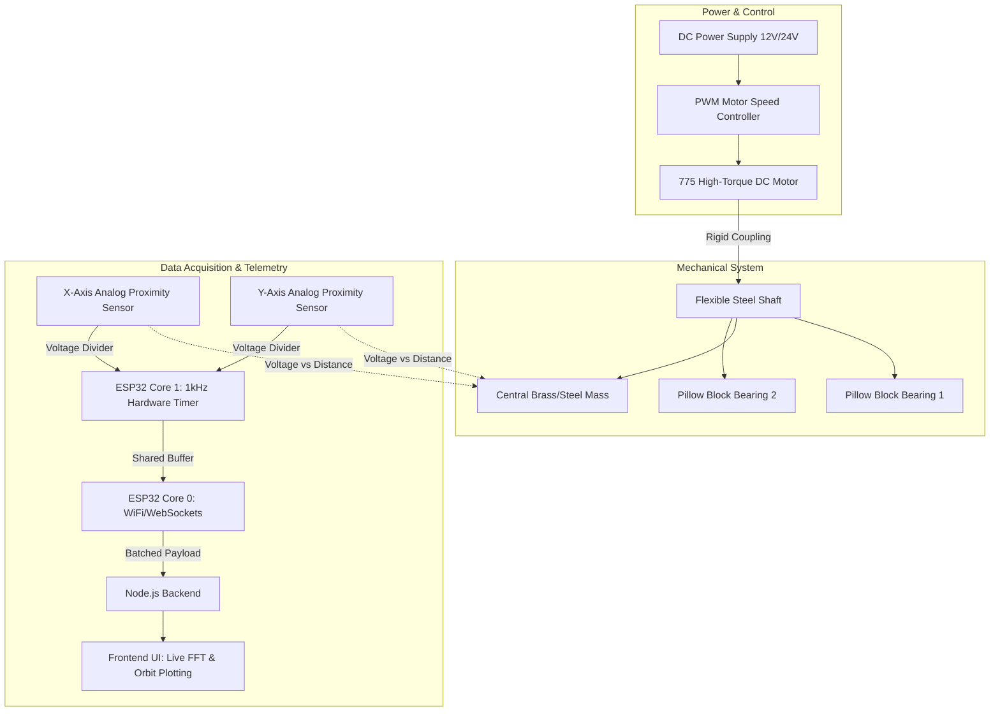
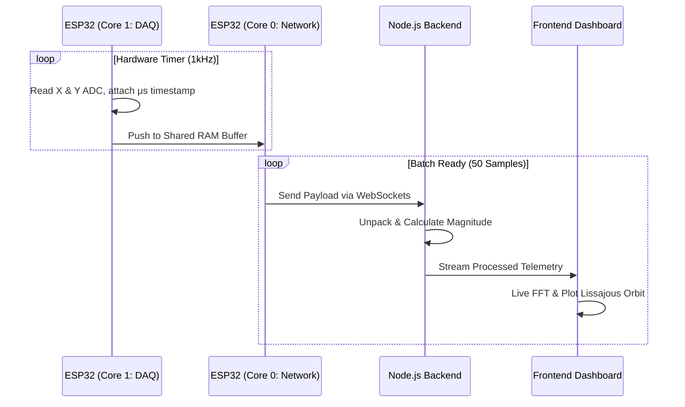

# Digital Whirling Rig: Technical Design Review & Construction Guide

Welcome to the technical construction guide and design review for the **Digital Whirling Rig**. This modern educational laboratory apparatus is designed to physically demonstrate and analyze the circular orbital dynamics (whirling) of a flexible rotating shaft.

Unlike traditional analog setups, this project utilizes a fully digital, IoT-enabled pipeline. By leveraging high-speed analog sensors, dual-core microcontroller processing (ESP32), and a WebSocket-based Node.js backend, the system captures continuous 2D spatial coordinates mid-flight. This allows for real-time Fast Fourier Transform (FFT) analysis, automated critical speed detection, and live orbital plotting.

---

## ⚠️ Safety Warning
This rig operates at high rotational speeds (up to 3000 RPM) with intentional vibrational resonance.
- **Eye Protection:** Always wear safety glasses when operating.
- **Fasteners:** Ensure all setscrews (especially on the central mass and motor coupling) are securely tightened using thread-locker.
- **Enclosure:** Use a shatter-proof safety enclosure around the rotating components.
- **Clearance:** Keep loose clothing, hair, and tools away from the rotating shaft.

---

## 1. System Objectives
- **Orbital Trajectory Capture:** Continuously measure X and Y lateral displacement of the shaft mid-span.
- **High-Fidelity Signal Integrity:** Maintain a strict hardware-timed sampling rate of at least 1 kHz (1000 Hz) to satisfy the Nyquist-Shannon sampling theorem for shaft speeds up to 3000 RPM (50 Hz fundamental frequency).
- **Resonance Detection:** Provide clean, high-resolution amplitude data to backend software to calculate the first mode of resonance (critical whirling speed).
- **Cost-Effective & Locally Sourced:** Keep prototype costs under KES 15,000 using accessible, off-the-shelf industrial components.

---

## 2. System Architecture

The physical rig consists of a flexible shaft supported by two bearings, driven by a DC motor. The displacement of a central mass is monitored by two orthogonal analog proximity sensors, processed via an ESP32, and transmitted to a Node.js backend.

---

## 3. Hardware Selection & Bill of Materials (BOM)

Early design iterations considered I2C Time-of-Flight (ToF) sensors. However, a ToF sensor's maximum 50 Hz sampling rate causes complete signal aliasing. **High-Speed Analog Proximity Sensors** are utilized instead to allow the ESP32 ADC to sample at >10 kHz.

### Prototype Cost Breakdown (Kenyan Market)
Prices are estimated based on typical retail rates from local suppliers.

| Component Category | Specific Items | Estimated Cost (KES) |
| :--- | :--- | :--- |
| **Microcontroller** | ESP32 Development Board (NodeMCU or DevKitC) | 1,200 |
| **Sensors** | 2x Inductive Proximity Sensors (LJ12A3-4-Z/BX) or Infrared (TCRT5000) | 1,500 |
| **Motor & Drive** | 775 DC Motor (12V/24V) + PWM Speed Controller | 2,000 |
| **Power Supply** | 12V/24V DC Power Supply (5A+) | 1,800 |
| **Frame & Base** | 2020 Aluminum Extrusions & Fasteners | 2,000 |
| **Drivetrain** | 6mm/8mm Flexible Steel Shaft (500mm), Rigid Coupling | 1,200 |
| **Bearings** | 2x Pillow Block Bearings (KP08) | 1,200 |
| **Machining** | Central Mass (Machined brass/steel disc with set screw) | 800 |
| **Electronics** | Resistors (10kΩ/3.3kΩ for voltage dividers), perfboard, wire | 500 |
| **Total Estimated Cost** | | **~KES 12,400** |

---

## 4. Step-by-Step Construction

### Phase 1: Base & Structural Assembly
1. **Chassis:** Cut and assemble the 2020 Aluminum Extrusions to form a highly rigid, vibration-dampening bed. Use rubber dampening feet on the apparatus base.
2. **Motor Mounting:** Secure the 775 motor securely to one end of the extrusion. 
3. **Supports:** Attach the two KP08 pillow block bearings. Leave bolts finger-tight to allow for alignment.

### Phase 2: Drivetrain Assembly
1. **Central Rotor:** Slide the machined brass/steel mass onto the exact mid-span of the flexible steel shaft. Secure it with a set screw. This lowers the critical speed into a safe, testable RPM range (e.g., 1200 - 1800 RPM).
2. **Shaft Installation:** Slide the shaft through the bearings and attach it to the motor via the rigid coupling.
3. **Alignment:** Ensure the motor shaft, coupling, and bearings are perfectly colinear before tightening the bearing bolts.

### Phase 3: Sensor Integration & Signal Conditioning
1. **Sensor Bracket:** Construct a custom rigid gantry to suspend the two analog proximity sensors at precisely **90°** to each other (Top and Side) over the central mass. Ensure sufficient radial clearance to prevent physical clipping during maximum amplitude resonance.
2. **Signal Conditioning:** The inductive sensors operate at 12V. Route the sensor outputs through a precision resistor voltage divider (10kΩ / 3.3kΩ) to step the logic level down to the ESP32’s safe 3.3V ADC threshold.

---

## 5. Software Architecture: Firmware & Data Pipeline

To prevent network jitter and CPU starvation from compromising the time-domain data required for accurate FFT analysis, the ESP32 firmware utilizes a **Dual-Core FreeRTOS Architecture**:

- **Core 1 (Data Acquisition Task):** Dedicated entirely to mechanical readings. A hardware timer interrupt triggers every 1000 μs (1 kHz). It reads the X and Y ADC channels, attaches a high-resolution `esp_timer_get_time()` microsecond timestamp, and pushes the struct into a statically allocated memory buffer.
- **Core 0 (Telemetry Task):** Dedicated to the WiFi and network stack. It monitors the Core 1 buffer. Once a batch of 50 samples is accumulated, Core 0 serializes the data into a binary payload (or dense JSON array) and pushes it over WebSockets to the Node.js server.
- **Backend Analysis:** The Node.js server receives the batched data, unpacks it, calculates the combined magnitude ($Magnitude = \sqrt{X^2 + Y^2}$), and feeds it to the frontend UI for live FFT processing and orbital plotting.

---

## 6. Risk Assessment & Mitigations

| Risk / Failure Mode | Consequence | Implemented Mitigation |
| :--- | :--- | :--- |
| **Data Aliasing** | FFT engine outputs false frequencies; orbit plots look erratic. | Abandoned I2C sensors. Switched to analog sensors sampled at 1,000 Hz via hardware timer interrupts. |
| **Network Jitter** | Time deltas fluctuate ($\Delta t$), destroying FFT spectral accuracy. | Implemented data batching on ESP32. High-precision microsecond timestamps are generated before network transmission. |
| **Mechanical Clipping** | Shaft impacts sensors during resonance, causing physical destruction. | 3D CAD modeling utilized to establish maximum deflection amplitudes; sensors positioned with a calculated radial clearance buffer. |
| **Frame Resonance** | System reads table/frame vibrations rather than pure shaft whirling. | Use of heavy 2020 aluminum extrusions and rubber dampening feet on the apparatus base. |

---

## 7. Operation & Dynamics Workflow

When accelerating the rig, the system captures data through three dynamic phases (Subcritical, Critical/Resonance, Supercritical).

By carefully managing processor load via FreeRTOS and ensuring strict adherence to digital sampling theorems, this apparatus delivers research-grade vibration telemetry at a fraction of the cost of commercial industrial monitoring equipment.
